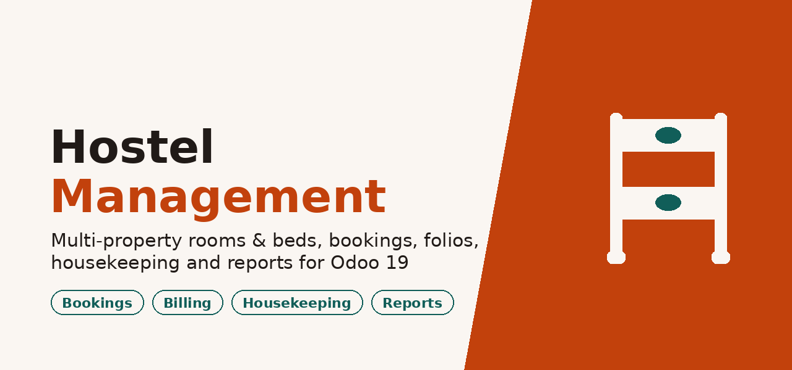
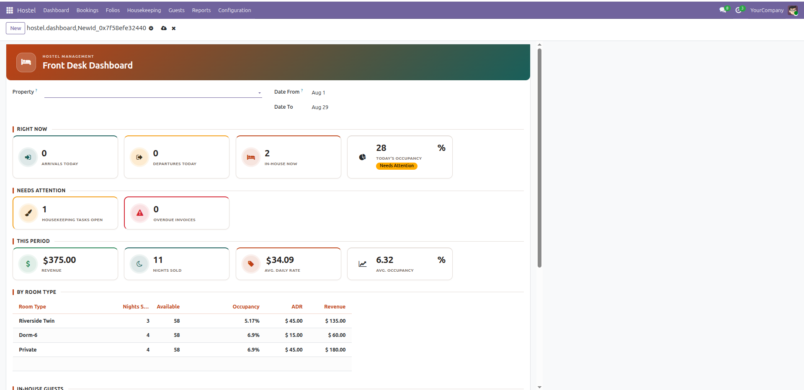
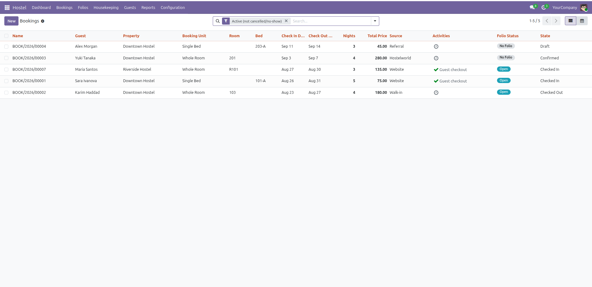
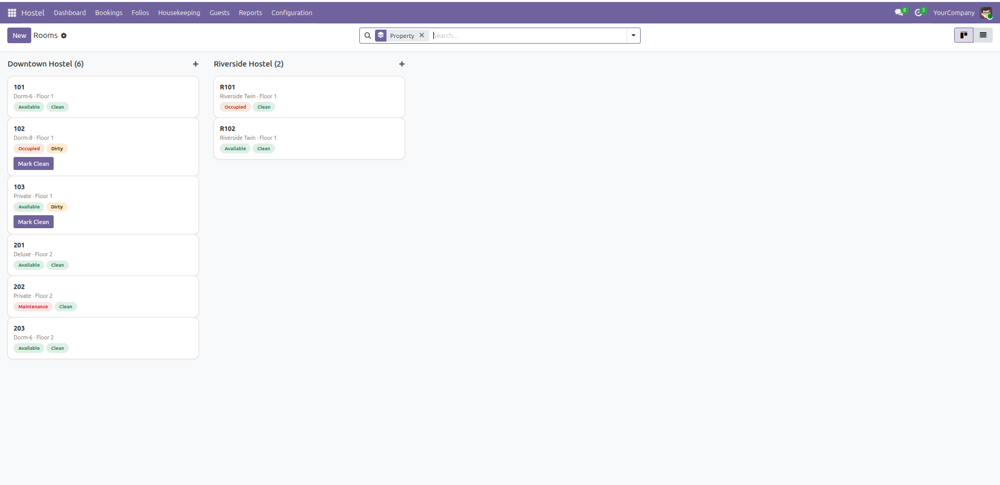
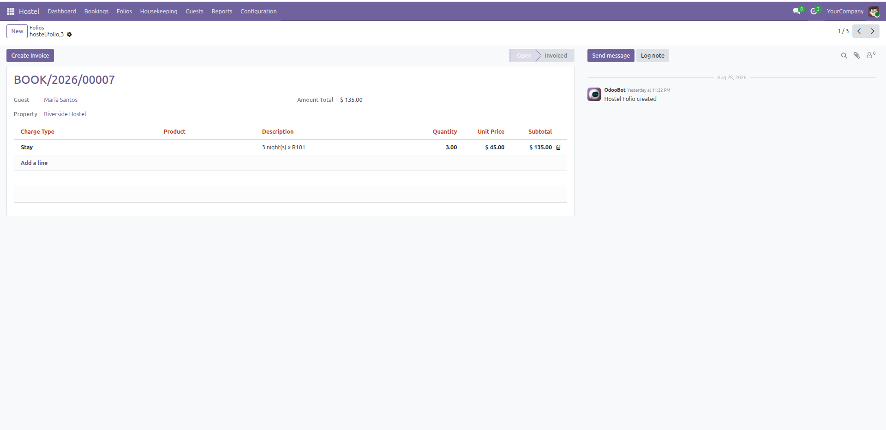

<p align="center">
  
</p>

<p align="center">
  <b>A complete guest-hostel PMS for Odoo 19</b><br/>
  Multi-property rooms &amp; dorm beds · overlap-safe bookings · folios &amp; billing · housekeeping · live front-desk alerts · reports
</p>

<p align="center">
  
  
  
</p>

---

Built **only** on modules available in Odoo Community (`base`, `mail`, `bus`, `contacts`,
`account`, `product`, `calendar`) — no Enterprise dependency, no Studio, no Documents app, no
third-party Python packages. Installs and behaves identically on Community or Enterprise.

## Screenshots

**Front desk dashboard** — arrivals, departures, in-house, occupancy, what needs attention, and
period revenue/ADR with a per-room-type breakdown.



**Bookings** — folio status, activity reminders, and the full stay lifecycle at a glance.



**Rooms** — kanban grouped by property, with independent occupancy and housekeeping status.



**Folios** — an itemized running bill per stay, invoiced through standard Odoo Invoicing.



## Features

**Master data** — properties, room types (private room or dorm, bed type, amenities, photos),
rooms and beds with independent occupancy vs. housekeeping status, and rate plans layered on top
of a room type's flat default rate. Every descriptive list (amenities, bed types, sleeping types,
ID document types, cancellation policies, booking sources, charge types) is an editable model, not
a hardcoded picklist.

**Bookings** — whole-room or single-bed, with an overlap constraint that correctly blocks a
whole-room booking against every bed inside it and vice versa. Price is locked at booking time, so
a later rate change never moves an existing booking's price. Deposits, OTA source/reference
tracking, and a full lifecycle (`draft → confirmed → checked_in → checked_out`, plus `cancelled`
and `no_show`) where check-in/check-out actually drive room and bed status, including the
partial-occupancy dorm cascade.

**Folios &amp; billing** — an itemized running bill per stay, auto-opened at check-in with its stay
line pre-filled. Add charges (laundry, food, damage, tours) any time, then invoice with one click
through standard Odoo Invoicing — no hardcoded tax. Cancelling or deleting an invoice
automatically reopens its folio for re-billing.

**Housekeeping** — a checkout-clean task auto-created on every checkout (deduplicated), tracked
pending → in progress → done → verified, with a one-click "Mark Clean" shortcut and a live popup
the moment a task is assigned.

**Live front-desk mechanisms** — popup notifications for arrivals today, checkouts today, and
overstays; automatic no-show detection that frees a room nobody checked into; overdue-invoice
reminders; deposit enforcement at check-in; automatic booking-confirmation emails; a guest
blacklist that blocks confirming new bookings; and deletion guards so a room, bed, or folio with
real history can't be silently removed out from under a booking.

**Dashboard &amp; reports** — a front-desk KPI dashboard (arrivals/departures/in-house/occupancy,
what needs attention, period revenue/nights/ADR, per-room-type breakdown, in-house guests and
upcoming arrivals), QWeb PDFs (booking confirmation, check-in registration card, folio, daily
arrivals &amp; departures, occupancy/ADR summary), plus revenue/occupancy pivot and graph views.

**Security** — property-scoped access for Staff and a separate Housekeeping role (unrestricted if
no properties are assigned, rather than locked out); Manager is always unrestricted; guest
ID-document fields are field-level protected.

**Migration scripts** included, so upgrading an existing install carries old data forward cleanly.

Deliberately out of scope: POS folio integration, a guest-facing portal, and OTA channel-manager
live sync (manual `source`/`external_ref` logging only).

## Requirements

- Odoo **19.0** (Community or Enterprise)
- No third-party Python packages

## Installation

1. Copy this folder into your Odoo addons path.
2. Restart Odoo and update the Apps list (Developer Mode on).
3. Search for **Hostel Management** and install.

Or from the command line:

```bash
./odoo-bin -c odoo.conf -d your_database -i hostel_management
```

To try it with sample data, add `--with-demo` on a **fresh** database (Odoo only loads demo data
at a database's first install).

## First steps

1. **Configuration → Properties** — create your property (address, timezone, check-in/out times).
2. **Configuration → Room Types**, then **Rooms** and **Beds** — every room carries at least one
   bed record, including single-occupancy private rooms, since occupancy is tracked per bed.
3. **Settings → Users** — give your team the **Hostel Staff**, **Hostel Housekeeping**, or
   **Hostel Manager** role. Leave *Hostel Properties* empty for full access, or assign properties
   to scope a user to them.
4. **Bookings → New** — book a room or a bed, then walk **Confirm → Check In → Check Out** and
   watch the folio, room status, and housekeeping task follow along.

## Security roles

| Role | Access |
|---|---|
| **Hostel Staff** | Front desk: bookings, folios, properties, room types, rate plans; read-only on the configuration lists |
| **Hostel Housekeeping** | Rooms and housekeeping tasks; read-only on beds; no access to bookings, folios, or guest ID documents |
| **Hostel Manager** | Everything above, never restricted by property |

Guest ID document fields (type, number, scan, date of birth) are stripped from the form
server-side for users outside Hostel Staff/Manager — real access control, not a CSS hide.

Property scoping is opt-in: a Staff or Housekeeping user with **no** properties assigned sees
everything; assigning at least one property restricts them to it.

## Testing

```bash
./odoo-bin -c odoo.conf -d your_database -u hostel_management \
  --test-enable --test-tags /hostel_management --stop-after-init
```

115 tests across master data, bookings, folios, housekeeping, dashboard, reports, and security.

## License &amp; support

Licensed under the [Odoo Proprietary License v1.0 (OPL-1)](hostel_management/LICENSE). Available on the Odoo Apps
Store. Release notes in [CHANGELOG.md](hostel_management/CHANGELOG.md).
